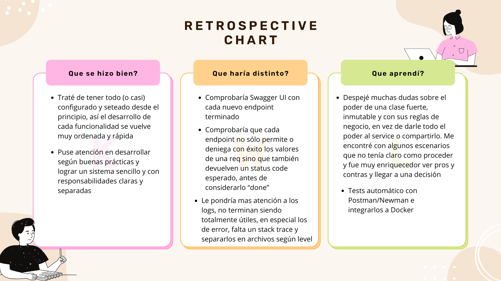

# encodelabs-technical-test

This repository is for a Encodelabs technical-test.

### Author: Nicolás W.

Este documento detalla el análisis, desarrollo y las decisiones técnicas del presente proceso de selección.
El documento en su totalidad fue escrito a mano.


# RUN EncodelabsApplication

### Levantar la aplicación con Docker

Este proyecto usa Docker para construir y ejecutar la aplicación Spring Boot.

### Requisitos

- Docker service instalado y corriendo
- Terminal tipo Bash (Linux, Mac o Git Bash en Windows)
- IntelliJ IDE
- GIT

## Levantar la app

Clonar el repositorio desde tu terminal en el directorio que quieras:

```bash
git clone https://github.com/nicoprogramming1/encodelabs-technical-test.git
```

No necesitás instalar manualmente dependencias, compilar ni correr la app desde IntelliJ. Todo se hace dentro de Docker.

Desde la raíz del proyecto, ejecutar en Bash / Git Bash:

```bash
chmod +x run.sh      # (Solo la primera vez en Linux)
./run.sh
```
Esto en general hará automáticamente lo siguiente:
- Levanta los contenedores definidos en docker-compose.yml
- Realiza comprobaciones de salud (health checks) para verificar que los servicios estén activos
- Levantar la app
- Insertar 3 productos correctamente (seeding)
- Ejecutar los tests automáticos con newman
- Dejar la app corriendo para uso

Para detenerla presionar "Ctrl + C" y remover la instancia de docker que generó con "docker compose down"
También podrían simplemente detener el container en vez de removerlo.

### A tener en cuenta!

Me tomé el atrevimiento de sumar algunas pocas cosas:

- El atributo id ahora es un ***UUID*** generado y con un formato validado (en vez de Integer incremental)
- Se agrega un atributo ***boolean isActive*** para implementar soft/hard delete
- El atributo price pasa a ser ***Money money***, Value Object con su currency y value para disponer de 
relaciones y las consecuencias de éstas
- Product ***Timestamps***
- Respecto al ***update*** de product: voy a implementar un PUT, recibir la data completa y en base a ello un save.
Esto por que estoy cerca del límite de entrega (dos días) y me parece razonable cumplir primero con la entrega al cliente
(si fuera un desarrollo real) de un sistema funcional en condiciones. Si hay oportunidad a posteriori, se puede fácilmente
refactorizar e implementar un PATCH.
- No hay integración entre Jira y el repositorio de GitHub

# Análisis y diseño de la aplicación

Debido a la simplicidad requerida en el enunciado, no se presentarán modelos de clases de diseño
o diagramas de transición de estados, ni un análisis funcional riguroso.
Se apuesta a lograr una aplicación SIMPLE, que resuelva el enunciado de una manera elegante, basada en buenas prácticas,
utilizando patrones de diseño, principios SOLID, DRY, Inmutabilidad, Single Responsability y otros.

De todas maneras, el desarrollo estará guiado según metodologías ágiles (SCRUM), aunque sin hacer
hincapié en el detallismo o ahondar en este aspecto ya que no es requerido y conlleva tiempo.
Las estimaciones y épicas no son rigurosas y las historias de usuario no tienen un comentario, actores ni
especificaciones puntuales.

El desarrollo tomará solo un Sprint de 7 días (máximo) y será gestionado en Jira:

### Jira

https://wnorowsky.atlassian.net/jira/software/projects/ET/boards/38/backlog (deberían tener acceso público)

Al final del docuemnto, junto a la retrospectiva, se presentará el ***Burndown chart***.


## Criterios de validación

| ***Product***
- id (UUID): autogenerado de 32 caracteres
- name (String): mínimo 3 caracteres, máximo 100
- description (String): máximo 300 caracteres, permite null
- money (Money): value object Money
- quantity (Integer): debe ser un número positivo hasta 1000 (por establecer un límite de negocio)

| ***Money***
- currencyCode (Currency): por default USD no se va a implementar múltiples monedas
- priceAmount (BigDecimal): debe ser un número positivo (BigDecimal por precisión)


# Decisiones técnicas

Se presenta a continuación las decisiones técnicas adoptadas durante el desarrollo.


### Stack tecnológico

- **Lenguaje:** Java (JDK 21)
- **Framework:** Spring Boot
- **IDE:** IntelliJ
- **Base de Datos:** H2
- **ORM / Persistencia:** Spring Data JPA
- **Mapper:** MapStruct
- **Validaciones:** Jakarta Bean Validation
- **Manejo de errores:** `@ControllerAdvice` | GlobalExceptionHandler + excepciones personalizadas
- **Pruebas:** Postman
- **Arquitectura:** Layered (con ciertos conceptos DDD)
- **Gestión de configuración:** `application.yml` / `.env`
- **Contenedorización:** Docker
- **Documentación:** Swagger
- **Control de versiones:** Git / Github
- **Gestor de proyecto:** Jira


### Arquitectura

Se adoptará un diseño en capas o ***Layered*** (Controller / Service / Repository) por simplicidad, claridad
y porque permite separar responsabilidades sin "sobre-ingeniería".
De igual manera se tomarán principios de ***DDD*** compatibles con esta arquitectura tales como entities con lógica
y sus propias validaciones de negocio y value objects (como price -> money).
En un entorno más complejo o que fuera a crecer en un futuro, consideraría quizás una arquitectura hexagonal para una
mejor escalabilidad y testeabilidad.
Creo que la arquitectura elegida es ***suficiente***, de lo contrario el costo de desarrollo aumentaría de forma
innecesaria.
Cumple con separar el dominio de la parte técnica, sin dependencia de frameworks
Se seguirá además el principio code-first para generar la db desde el código.


### Patterns

Realmente hay varios de ellos que por supuesto se implementan de manera implícita, se discrimina solo algunos junto a
los implementandos explícitamente para cubrir una necesidad técnica o por buenas prácticas de desarrollo escalable y de bajo
acoplamiento.

- Adapter: de manera implícita, MapStruct actúa como adapter entre los DTOs y el modelo de dominio (en un sistema más
  complejo encapsularía la dependencia detrás de una interfaz para permitir el cambio de estrategia de mapeo pero no lo veo
  necesario aquí).
- Builder: al recuperar un producto desde DB, construye un product entity con todos sus atributos.
- Data Access Object: de manera implícita por ejemplo en JPA Repository
- Data Transfer Object: los DTOs implementados desacoplan la presentación de la entidad
- Factory Method: al crear un nuevo producto, con sólo los atributos necesarios provenientes de la request.
- Repository: para acceder a la base de datos evitando acoplamiento con la infrastructura.


### Dependencias

Sólo se discriminan aquellas de índole utilitaria (no las del ecosistema de Spring Boot o la db)

- MapStruct: para mapear
- Spring dev tools: para live reload
- Spring-dotenv: para acceder a los .env (aunque también se podría hacer de forma nativa)
- Lombok: para logger y algunos decoradores de clase para reducir código boilerplate


### Exceptions

Se implementarán handlers global y personalizados (bad request, validation y not found), con su log
correspondiente y la información pertinente para el posterior debug.
Las clases de cada excepción personalizada heredan de la clase abstracta ApiException que a su vez
hereda de RunTimeException y le pasa a través del super el message para que este lo guarde y poder
recuperarlo luego en el handler.

***Error cases***

- Para respuestas HTTP -> ApiException y @ControllerAdvice
- Por errores controlados que no interrumpan el flujo -> try-catch
- Por errores de librería -> try-catch y ApiException
- Los errores inesperados los captura Spring


## Documentación

Además del presente Readme, se seguirán buenas prácticas de código auto-documentado,
comentarios javaDocs estandarizados, commits continuos y Swagger.
No se implementará mucha configuración para Swagger, en una aplicación de mayor peso
se gestionaría en un clase una personalización mayor de la información presentada y las
respuestas, como del proyecto en general y su autoría, agrupación de paths relacionados, etc.

***El código está SOBRE-COMENTADO en detalle, esto por razones de ser una prueba técnica, de lo contrario
me limitaría a la mínima expresión necesaria para transmitir de forma clara y concisa.***

***Actualización 18/6***: Swagger UI no funciona aún, en una instancia temprana del proyecto si no recuerdo mal lo dejé
funcionando y he ido documentando los controllers y demás, pero hoy no logro hacerlo funcionar (implementé clase de configuración
OpenAPI e incluso en el genericHandler excluí las urls de swagger para que la ApiResponse no colisione pero no logré dejarlo estable
y volví atrás estos intentos).
Lamentablemente en las pocas horas que tengo de plazo no puedo solucionarlo, investigaré al respecto, seguro hay algo que se me está
pasando por alto, para la próxima lo tendré solucionado ! =D

## API Response

Se implementa una plantilla de respuesta standard para consistencia en el front.
El campo data es un array, ya que en caso de no devolver datos no llega un null sino []
y a la vez está preparado para gestionar listas.
La response expone a través de sus métodos success / failure un objeto de tipo:

```
    {
        boolean success,
        String message,
        List<T> data
    }
```

# Retrospectiva



### Burndown chart:

https://wnorowsky.atlassian.net/jira/software/projects/ET/boards/38/reports/burnup

# Comentarios finales (18/6 - 13hs)

Fue muy divertido y me sirvió para recordar/ampliar conceptos y para implementar situaciones de arquitectura / DDD que entren
en conflicto entre sí y toparme con el problema, entenderlo, buscar una solución y en definitiva aprender de la experiencia.
Me sentí muy seguro, entiendo lo que hice y a conciencia, el uso de IA fue mínimo, para valorar situaciones y resolver dudas,
nunca para copiar código, prefiero saber hacerlo!
Hay algunos tests que no logré que lo que debiera ser una bad request, devuelva 400. Hay algún conflicto con los handlers
o estoy pisando de alguna manera el code status, pero realmente funcionan y no permiten la acción que se está probando si se
espera una excepción, solo que con un code 500 en vez de 400. Necesitaría debuggear con tiempo y solucionarlo.
Si bien no es mi primera vez con Docker y levantando de manera similar la app, es por lejos la implementación más completa que
he tratado hacer así que espero no haberme dejado nada de lado y que puedan solo con el .sh ver la app corriendo y pasando los test
igual que la veo yo en mi pc.
Muchas gracias !!
Nico.